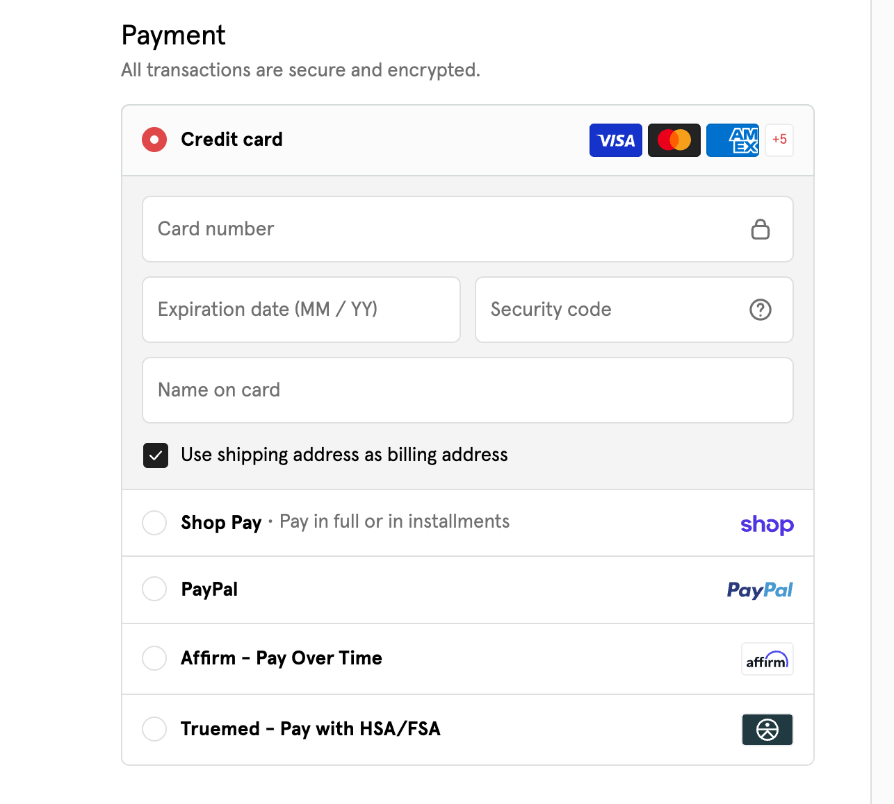

No. Truemed cannot be combined with a buy now, pay later service such as Affirm, Klarna, or Afterpay, and it cannot be combined with other third-party options like PayPal or Shop Pay.

## Truemed is its own payment option

At checkout, the store shows each available payment method as a separate choice. Truemed appears in that list as **Truemed, Pay with HSA/FSA**, alongside options like credit card, Shop Pay, PayPal, and Affirm.

You pick one. Selecting Truemed sends you into the Truemed checkout flow, and the other services are no longer part of the transaction. The payment options shown vary by store, so you may not see all of these at every merchant.

## What you can do once you select Truemed

After you select Truemed, you have three ways to pay:

1. **Pay in full with your HSA/FSA card.** If you qualify and your card has enough available balance, the whole eligible amount is charged to your HSA/FSA card.
2. **Split between your HSA/FSA card and a debit or credit card.** Charge part of the order to your HSA/FSA card and cover the rest with a standard card in the same checkout. See [Can I Pay with Both My HSA/FSA Card and a Credit Card?](/shopping-checkout/can-i-pay-with-both-my-hsa-fsa-card-and-a-credit-card) for how this works.
3. **Pay in full with a debit or credit card, then reimburse yourself.** Complete the purchase with a regular card. If an independent licensed practitioner reviews your health survey and issues a Letter of Medical Necessity (LMN), you can submit that LMN and your receipt to your HSA/FSA administrator to request reimbursement.

<Note>
Eligibility is not automatic. Items may be eligible for HSA/FSA payment when they are used to treat, mitigate, or prevent a specific health condition, and an independent licensed practitioner decides whether to issue an LMN after reviewing your clinical intake form.
</Note>

## Why Truemed and buy now, pay later cannot be combined

Buy now, pay later services work by splitting your purchase into scheduled installments financed by that provider. HSA and FSA funds have to be applied to a qualified medical expense at the time of the transaction, against a documented medical need.

Those two models cannot run on the same order, so the store's checkout treats them as separate paths.

## If you want to spread the cost over time

Truemed does not offer installments. If paying over time matters more to you than paying with your HSA/FSA card at checkout, the third option above is the closest fit:

1. Choose Truemed at checkout and pay in full with your debit or credit card.
2. Complete the health survey during the Truemed flow.
3. If a practitioner issues an LMN, download it and your receipt from the **Orders** tab of your dashboard at [truemed.com](https://truemed.com).
4. Submit both to your HSA/FSA administrator to request reimbursement.

<Warning>
Your HSA/FSA administrator makes the final decision on any reimbursement request. Check your plan details before you buy so you know what documentation your administrator requires.
</Warning>

## Frequently Asked Questions

**Can I use Affirm for part of my order and my HSA/FSA card for the rest?**

No. A single order goes through one payment path. If you want to use HSA/FSA funds on part of the order, select Truemed and use Split Pay to divide the payment between your HSA/FSA card and a debit or credit card.

**Can I pay with PayPal or Shop Pay through Truemed?**

No. Truemed accepts HSA/FSA cards and standard debit and credit cards. PayPal, Shop Pay, and similar services are separate payment options offered by the store.

**I already checked out with Affirm. Can I still use my HSA/FSA funds?**

Not through Truemed on that order. Truemed issues an LMN as part of its own checkout flow, so the purchase has to go through Truemed. If you have already paid another way and want to use Truemed to take advantage of your HSA/FSA funds, you can contact the merchant partner directly to see if you can cancel or return the order and place a new one.

**Does the store decide which payment options I see?**

Yes. Each merchant chooses which payment methods to offer, so the list at checkout differs from store to store. If you do not see Truemed at a store you expected it at, the merchant may not offer it or the items in your cart may not be eligible. See [Product Not Showing as Eligible at Checkout](/shopping-checkout/product-not-showing-as-eligible-at-checkout).

**Who do I contact if I have a question about my order?**

Email [support@truemed.com](mailto:support@truemed.com) and include the email address you used at checkout.
