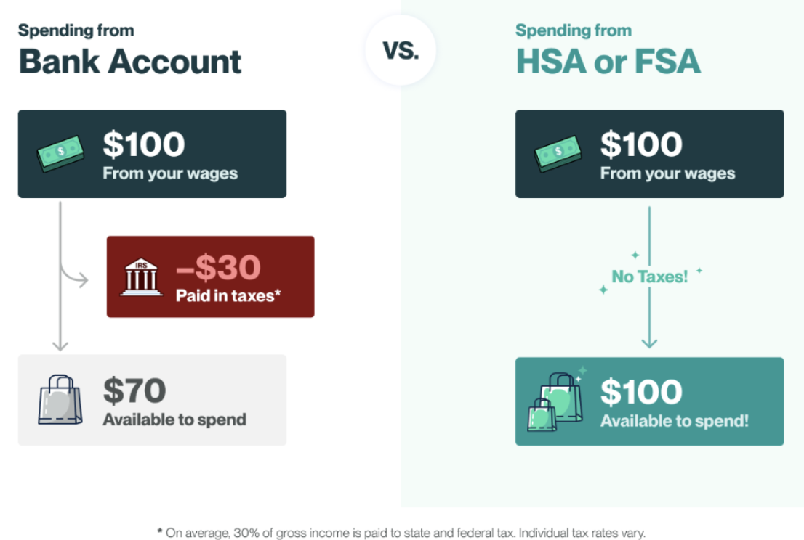

## What is Truemed

Truemed is a payment platform that connects your pre-tax HSA (Health Savings Account) or FSA (Flexible Spending Account) funds to purchases that qualify as medically necessary. Through a clinical intake form reviewed by an independent, licensed clinician, Truemed determines whether your purchase qualifies and issues a Letter of Medical Necessity (LMN) to support your payment or reimbursement.

Eligible product categories include fitness equipment, supplements, sleep products, recovery tools, health tech, and more — purchased from Truemed partner brands.

Qualified customers save an average of 30%\* compared to paying with after-tax income.

---

## How It Works

There are two ways to pay using Truemed, depending on how the merchant is set up:

- **At-checkout (Orders):** Pay directly with your HSA/FSA card during checkout
- **Post-purchase (Reimbursements):** Pay with a credit or debit card, then submit for reimbursement from your HSA/FSA account

Both paths follow the same core process.

### Step 1: Find a Truemed Partner Brand

Browse partner brands at [truemed.com](https://www.truemed.com) across categories including fitness, sleep, supplements, recovery, and health tech. Partners include brands like Peloton, Eight Sleep, Garmin, AG1, Oura, and thousands more.

Once you find a product you'd like to purchase, proceed to the merchant's checkout as normal.

### Step 2: Complete the Health Intake

How you access the health survey depends on your payment path:

**At-checkout (Orders):** At the merchant's checkout, select Truemed as your payment option. To see this option, make sure you are checked out as a guest — you will need to be logged out of Shop Pay. After selecting Truemed, you will be directed to complete the clinical intake form before completing your purchase.

**Post-purchase (Reimbursements):** Complete your purchase as normal using a credit or debit card. After payment, you will receive a link to the health survey on the order confirmation page and in a follow-up email from the merchant.

In both cases, the clinical intake form — also called a health survey — collects information about your health needs so that an independent, licensed clinician can evaluate whether your purchase qualifies as medically necessary. No in-person visit is required.

<Note>
Your health information is kept confidential and is only used for the purpose of clinical review by an independent clinician.
</Note>

### Step 3: Receive Your Letter of Medical Necessity (LMN)

After you submit the intake, an independent, licensed clinician reviews your information. If your purchase qualifies:

- You receive an email notification that your LMN is ready
- Log in to your [Truemed dashboard](https://www.truemed.com) to access and download your LMN
- Your LMN is valid for **12 months** from the date of issue and covers eligible purchases from the qualifying merchant

If your purchase does not qualify, you will be notified of the outcome.

<Note>
Not all purchases are guaranteed to qualify. Eligibility is determined on a case-by-case basis by an independent clinician based on your health information and the specific product.
</Note>

### Step 4: Pay or Reimburse with HSA/FSA

**At-checkout path:** Select the HSA/FSA payment option at checkout and pay directly with your HSA or FSA card. Your LMN is generated as part of the checkout flow and no additional steps are needed after purchase.

**Reimbursement path:** Pay with a regular credit or debit card at checkout. Once you receive your LMN, submit it along with your receipt to your HSA/FSA administrator to reimburse yourself from your account.

<Tip>
Save your LMN and your purchase receipt together. Your HSA/FSA administrator may request both documents when reviewing your reimbursement claim.
</Tip>

---

## What is an LMN?

A Letter of Medical Necessity (LMN) is a document issued by an independent, licensed clinician that confirms a specific purchase is medically necessary for your health condition. It is what makes your purchase eligible for HSA/FSA payment or reimbursement.

Your LMN includes:

- A clinician's determination of medical necessity
- The specific product or product category covered
- The validity period (typically 12 months)

When your LMN is ready, you'll receive an email notification. Log in to your [Truemed dashboard](https://www.truemed.com) to access and download it. For more detail on LMNs, see [What is an LMN?.](https://help.truemed.com/letters-of-medical-necessity-lm-ns/lmn-basics/what-is-an-lmn)

---

## What Qualifies

Truemed covers products and services used to prevent, treat, cure, or mitigate a diagnosed health condition. Eligible categories include:

| Category | Examples |
|---|---|
| Fitness Equipment | Treadmills, stationary bikes, strength equipment |
| Health Tech | Fitness trackers, wearables, continuous monitors |
| Sleep | Mattresses, adjustable bases, sleep tracking devices |
| Supplements | Protein, vitamins, metabolic health supplements |
| Recovery | Saunas, cold plunge, red light therapy |
| Adaptive Footwear | Orthopedic and supportive footwear |
| Home Health | Air purifiers, ergonomic equipment |

Eligibility is not automatic. Whether a specific product qualifies depends on your individual health needs and the clinician's assessment of medical necessity. Two customers purchasing the same product may receive different eligibility outcomes.

---

## Is My Purchase Covered?

Eligibility is determined on a case-by-case basis. A few important things to know:

- Truemed does not guarantee eligibility for any purchase
- Eligibility is based on your personal health information and a clinician's assessment of medical necessity
- Your HSA/FSA plan administrator has final authority over reimbursement decisions — Truemed's LMN supports your claim but does not override administrator decisions
- Some administrators have specific documentation requirements (such as a clinician's signature or provider credentials) that may affect your claim

If your reimbursement claim is denied by your administrator, see [Why Was My Claim Denied?](/reimbursements-and-claims/why-was-my-claim-denied) for next steps.

---

## Truemed Availability

Truemed is currently available to customers in the **United States only**. HSA and FSA accounts are a US-specific benefit tied to US tax law, and Truemed's clinical and compliance infrastructure is built accordingly.

If you are located outside the United States, Truemed is not available at this time.

---

## Contact & Support

If you have questions about your LMN, a qualification in progress, or your Truemed account:

- **Help center:&#x20;**[help.truemed.com](https://help.truemed.com)
- **Email:&#x20;**[support@truemed.com](mailto:support@truemed.com)

---

\*Truemed is for qualified customers. HSA/FSA tax savings vary. Learn more at [truemed.com/disclosures](https://www.truemed.com/disclosures).
