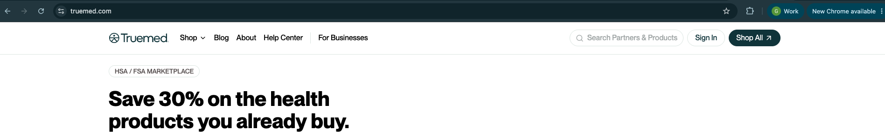
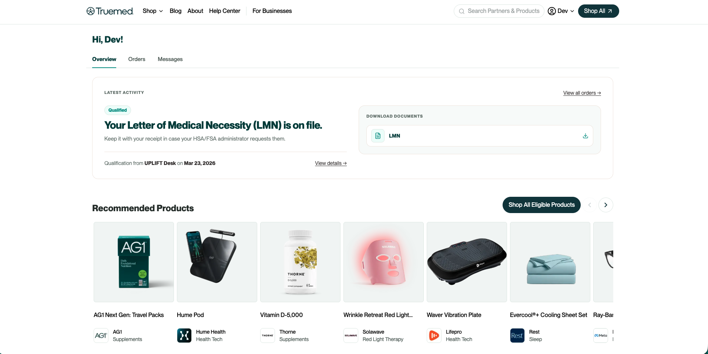
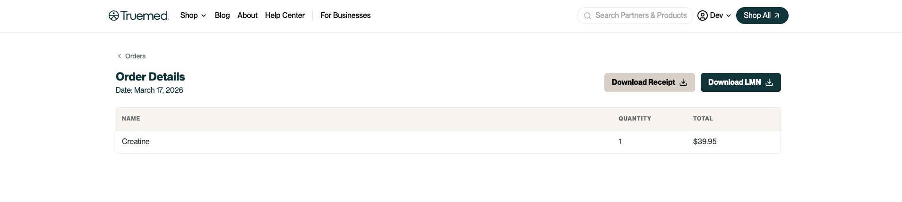
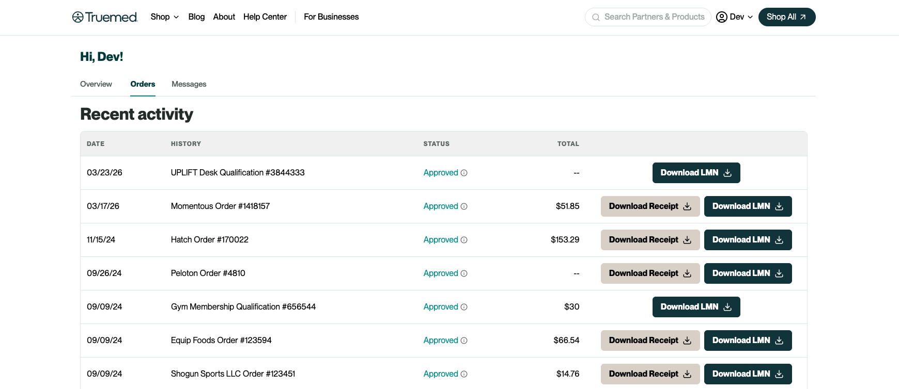

Your Truemed dashboard is the central place to manage your HSA/FSA qualifications, download your Letter of Medical Necessity (LMN), and view your orders. When you log in you land on your personalized **Overview** page, and you can move between three tabs: **Overview**, **Orders**, and **Messages**. This article walks through what each part of the dashboard does.

## Accessing your customer dashboard

To access your dashboard, go to [truemed.com](https://truemed.com) and sign in.

You will need the email address you used when you completed your Truemed qualification survey or checkout flow. This is typically the same email associated with your purchase from the merchant. If you are unsure which email you used, check your inbox for a confirmation or survey email from Truemed.

Once logged in, you will land on your **Overview** page. Use the navigation tabs to move between:

- **Overview**: a snapshot of your most recent activity, including your latest qualification status, any documents available to download, and recommended eligible products you can shop
- **Orders**: your full order history linked to Truemed, where you can open an individual order and download its receipt
- **Messages**: messages related to your qualifications and orders

## Viewing your qualifications and LMN

Your **Overview** page shows a **Latest Activity** card with the status of your most recent qualification. When an LMN has been issued for you, the card shows a **Qualified** badge, a note that your Letter of Medical Necessity (LMN) is on file, and the qualifying merchant and date. If a purchase has been refunded, the card shows the refund status instead.

To download your LMN, use the **Download Documents** section on your Overview page and select **LMN**. The LMN is a PDF document you can save to your device or share with your benefits administrator or HSA/FSA provider if they request documentation.

You can also open an individual order or qualification to see its details and download its receipt or LMN from there.

For a full record of your qualifications, open the **Orders** tab. Each order shows:

- **Issue date**: when the LMN was generated
- **Merchant**: the store or brand associated with the purchase
- **Status**: whether the LMN is Approved, Rejected, In review, or not required
- **Total amount**: only available for payment at checkout orders

If a receipt was issued by Truemed, you can download it from the **Download Documents** section on your **Overview** page or from the individual order in the **Orders** tab, when available. 

Truemed no longer sends LMNs by email. All documents are accessed securely through your dashboard to protect your personal health information.

## Troubleshooting a missing LMN

**If an LMN is missing from your dashboard:**

1. Confirm you are logged in with the exact email you used to complete the qualification survey.
2. Wait up to 48 hours after completing the survey. It can take time for your order to be processed.
3. Try logging in using an incognito or private browser window to rule out a caching issue.
4. If it still does not appear, contact [support@truemed.com](mailto:support@truemed.com) with your full name and the approximate date you completed the survey.

## Account settings

**To change the email address on your account**, you will need to contact [support@truemed.com](mailto:support@truemed.com). Email changes require verification to protect account security and cannot be made directly from the dashboard.
